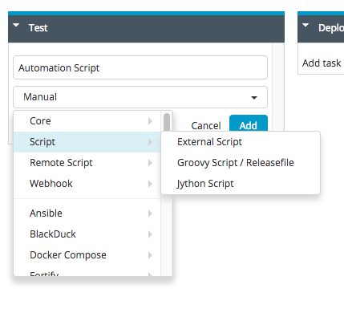

# Planning a release on XebiaLabs

_With XebiaLabs's XL Release, you can plan, automate, and optimize your pipeline visually in a neat, step-by-step diagram which is referred to as a "release"._

Log in to XebiaLabs. In the top navigation bar, click on the tab 'Release'. Then click on the 'New Release' button.

Fill out the information for your release. Notice that under 'Release details', you can specify the date which you want the release to start, among other things. 

You have now created your release. So far, it is a blank slate with only one phase. You can add more phases by clicking the 'Add Phase' button. 

In a release, you can plan several phases for the release. Phases are typically general, high level steps in your release pipeline, such as building, testing, and deploying. This will allow you to manage, control, and optimize your process easily with this kind of categorical organization. 

Each phase is comprised of many tasks which are more specific, such as testing, making sure prerequisites are fulfilled, running a script, or building. 

To add a new task, click on 'Add task' under the desired phase. 

In the dropdown menu, you can specify the type of task. Tasks will execute specific steps in the release process. In this example, the task we add will run an automation script. 

Once you are done with editing a release, you can click on the 'Start Release' to execute your pipeline process. 

If you want to view all your releases, you can click on 'Releases' at the top navigation bar and then select which ones you want to edit further. 

