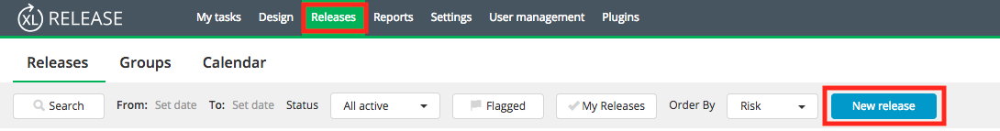
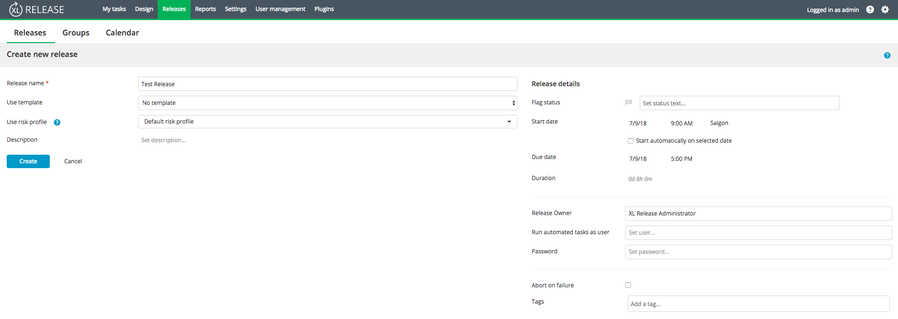
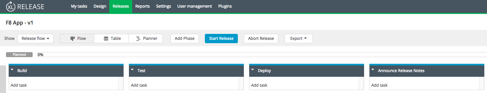

# Planning a release on XebiaLabs

In XL Release, create a new release. 

Name your release. Notice that under 'Release details', you can specify the date which you want the release to start, among other things. 

In a release, you can plan several phases for the project. This will allow you to manage, control, and optimize your process easily. 

Each phase is comprised of many task, such as testing, making sure prerequisites are fulfilled, or building. 

To add a new task, click on 'Add task' under the desired phase. 

In the dropdown menu, you can specify the type of task. 

With Xebia XL, you can plan all the steps of your pipeline and link it to multiple other platforms such as GitHub or Jenkins. 