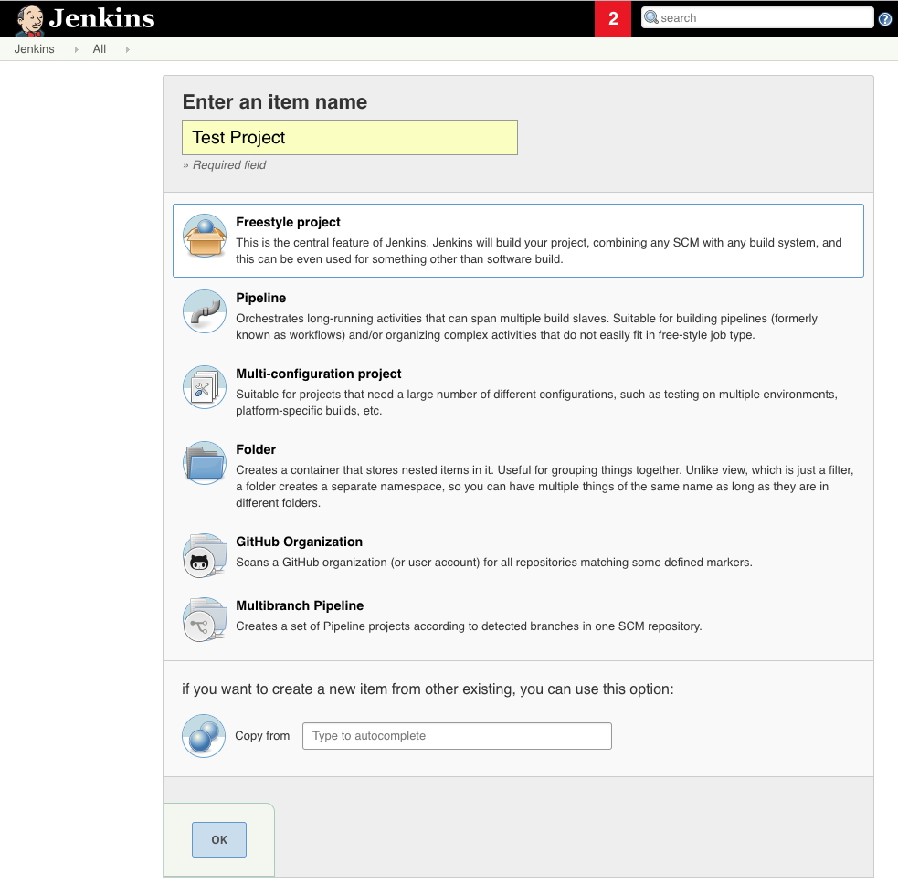
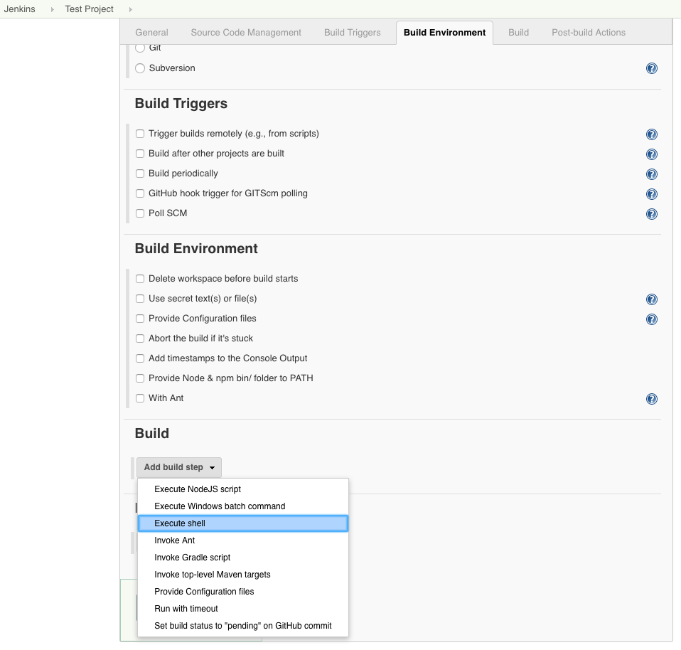
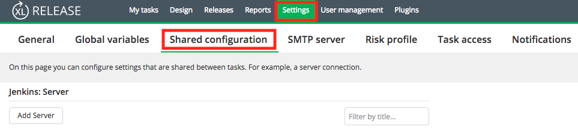
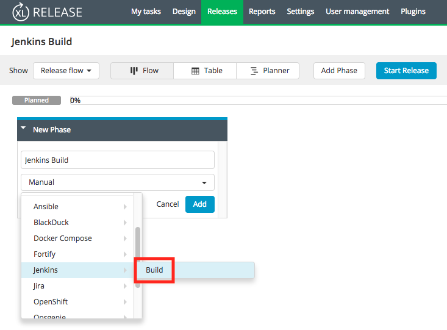
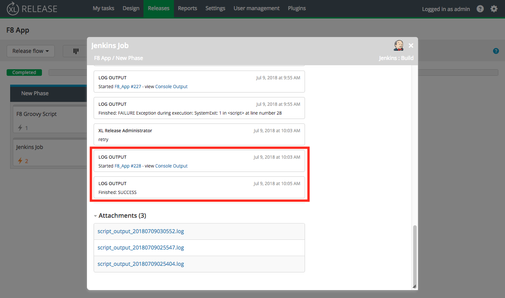

# Triggering a Jenkins build as a task on XebiaLabs

This guide will demonstrate how to set a XebiaLabs task to trigger a Jenkins build. 

## Prerequisites

* Jenkins is installed

* Have an account with XebiaLabs

#### 1.1 Create a new Jenkins job

On the left side of the site, click on 'New Item' to create a new project. 


Enter in a project name and select the project type 'Freestyle project'. 



In the configuration settings, go the 'Build' section. Click on 'Add build step' and select 'Execute shell'. 



Enter the necessary commands. The below example will execute the android-app-test script sample from Kobiton.

```
#!/bin/bash
[ ! -d "samples" ] && git clone https://github.com/kobiton/samples.git || echo "Samples already exist"
cd samples/javascript
npm install
npm run android-app-test
```

In your automation test, make sure to include your own Kobiton username and API key as well as the desired device and platform you wish to test with, which can be found on the Kobiton website.

This guide is executing the NodeJS test script from the Kobiton samples, so we will add the NodeJS Plugin on Jenkins to execute NodeJS script as a build step. To do this, go to 'Manage Jenkins' -> 'Manage Plugins' -> Available. Search for NodeJS and install it.


If you are using a different language, you may try to find a suitable plugin for your project if necessary.

Under build environment, check the box that says 'Provide Node & npm bin/ folder to PATH'.


Save your configuration settings. Try 'Build Now' and then check Kobiton cloud devices to see if a test session was created. If successful, you can move onto triggering a Jenkins build from a XebiaLabs task. 

#### 2.1 Install the Jenkins plugin

On XebiaLabs, click on 'Plugins' in the navigation bar at the top of the screen. In the search bar, type in 'Jenkins' and install it. 


#### 2.2 Update Jenkins plugin settings

In the navigation bar, click on 'Settings' and then 'Shared configuration'. 

Under 'Jenkins: Server', click on 'Add Server'. 



Enter in a title for the configuration, as well as the Jenkins url where the server can be reached. 

Under 'Authentication', enter in your Jenkins username and password. 


#### 2.3 Set Jenkins as a task

If you do not already have a release, create a new one. 


Click on 'Add task' under the desired phase. 


Set a name for the new task. Click on the dropdown menu and select 'Jenkins' and 'Build'. Then click the 'Add' button to finish creating the task. 



> You can also run an automation test script directly as a task in XebiaLabs, but there may be issues for Jython and Groovy scripts. 

Click on the task to open up the settings. Enter in the Server name, which was created earlier. Enter your Jenkins username and password, as well as the name of the job you want to trigger in Jenkins. 


Exit out of the settings and start your release. You have successfully created a task that will trigger a Jenkins build!

Check the log output in your task to see if the build was successful.  

